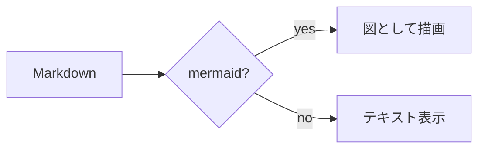
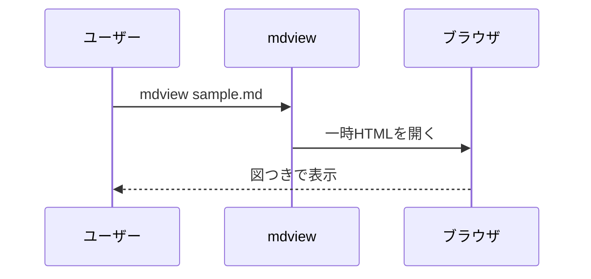

# mdview 動作確認サンプル

これは **mdview** の表示テスト用ファイルです。

## テキスト装飾

- **太字**、*斜体*、`インラインコード`
- [リンク](https://example.com)
- 引用:

> 引用ブロックはこのように表示されます。

## コードハイライト

```js
const greet = (name) => `Hello, ${name}!`;
console.log(greet("world"));
```

## mermaid フローチャート



## mermaid シーケンス図



## 表

| 機能 | 対応 |
|------|:----:|
| 見出し・表・引用 | ✅ |
| コードハイライト | ✅ |
| mermaid 描画 | ✅ |
